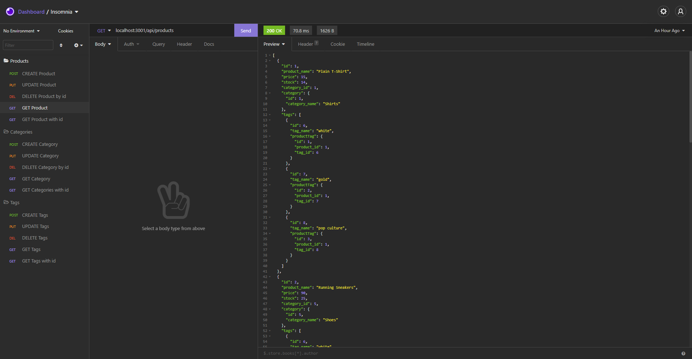

# E-commerce Back End 

## Description 

**ORM Challenge: Ecommerce Back End**

**Challenge Elements**\
Internet retail, also known as e-commerce, is the largest sector of the electronics industry, having generated an estimated US$29 trillion in 2017 (Source: United Nations Conference on Trade and Development). E-commerce platforms like Shopify and WooCommerce provide a suite of services to businesses of all sizes. Due to the prevalence of these platforms, developers should understand the fundamental architecture of e-commerce sites.

The challenge is to build the back end for an e-commerce site. I’ll take a working Express.js API and configure it to use Sequelize to interact with a MySQL database.

## Installation

Because this application won’t be deployed, I’ll also need to provide a link to a walkthrough video that demonstrates its functionality. There is a link to the video in the README of this project.

-The link to the video: https://github.com/AWiebe2021/Employee-Tracker/raw/main/SQL%20Challenge-Employee%20Tracker.mp4
-The projects code can be accessed at:https://github.com/AWiebe2021/fantastic-umbrella

## Screenshot

## Credits
Solo project